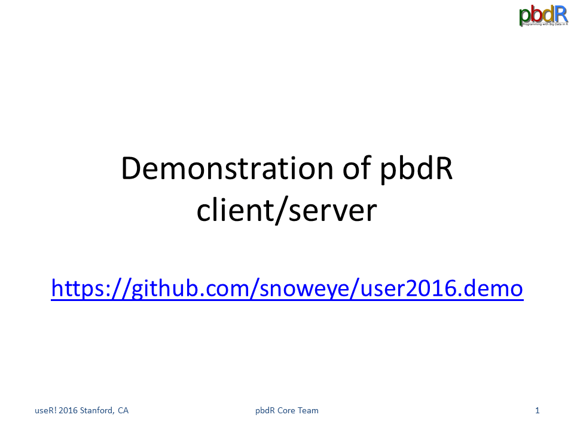
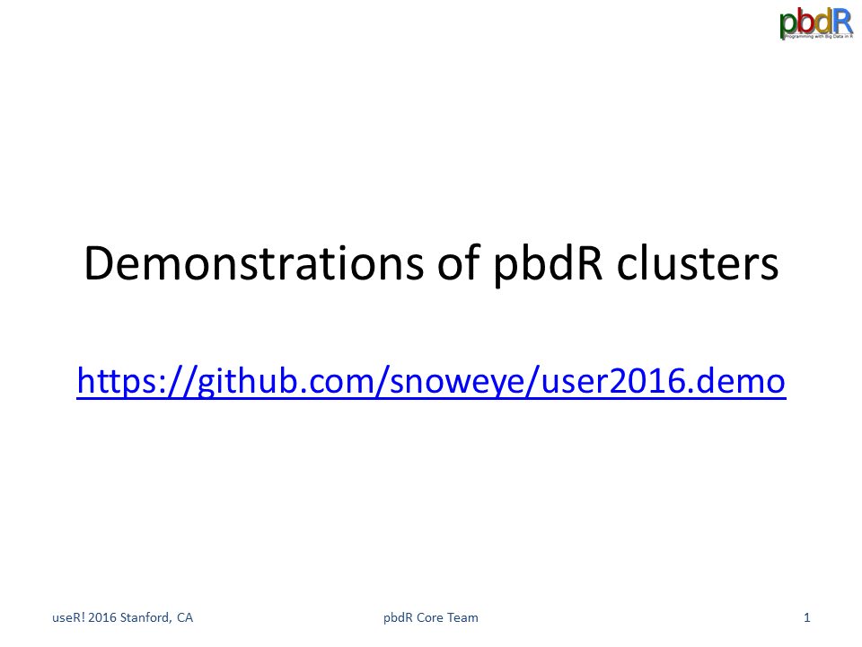

### There are two demonstrations (GIF animation) next

1. pbdR client/server using `pbdZMQ` + `remoter` (+ `getPass` + `sodium`)

2. pbdR client/server with MPI clusters using `pbdZMQ` + `remoter` + `pbdCS` (+ `getPass` + `sodium`) + `pbdMPI` + `pbdDMAT` + `pmclust`

### Advantages of pbdR Client/Server
- No need to setup X11 nor forwarding
- No need to setup httpd nor htt\* whatever services
- No need to know html\* nor js
- No need to open a web browser

### Limitations of pbdR Client/Server
- Too simple, you must speak R ...
- Too bad, you still need to understand Single Program Multiple Data (SPMD) ...

### Some Good News
- Allow to run most R packages (almost nothing change nor reimplementation)
- All source or binary packages are available on CRAN.
- Allow to run on major OSs including: **Mac OSX**, **Solaris** and **Microsoft Windows**.
- Allow to run across different systems
- Extendable to any out-of-core backend
- Password protected (masked as well)
- Encrypted communication (good data policy)

